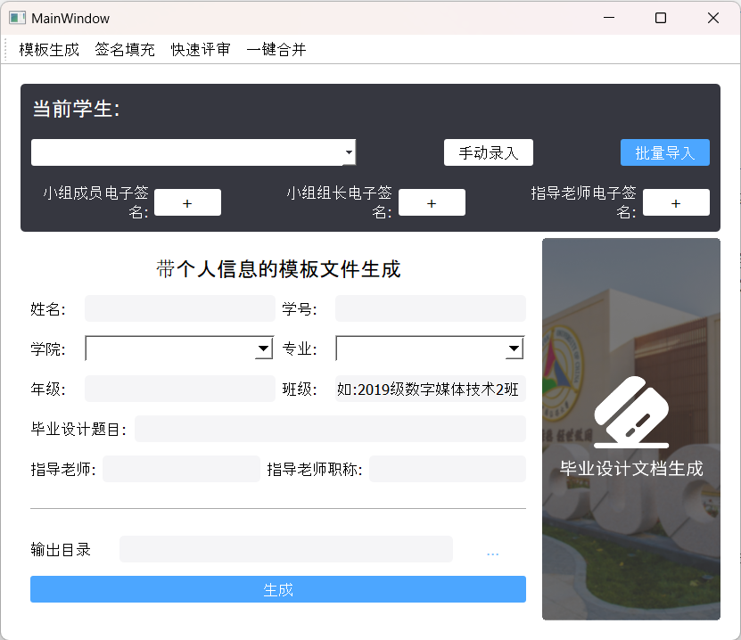
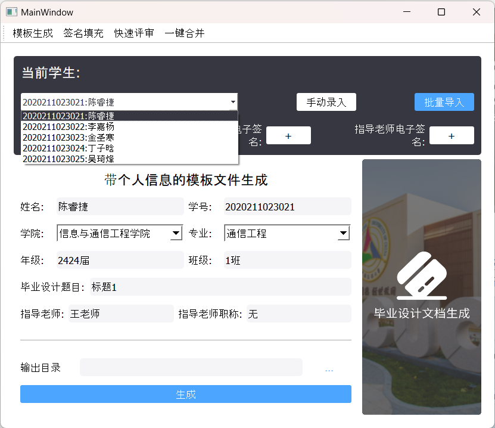
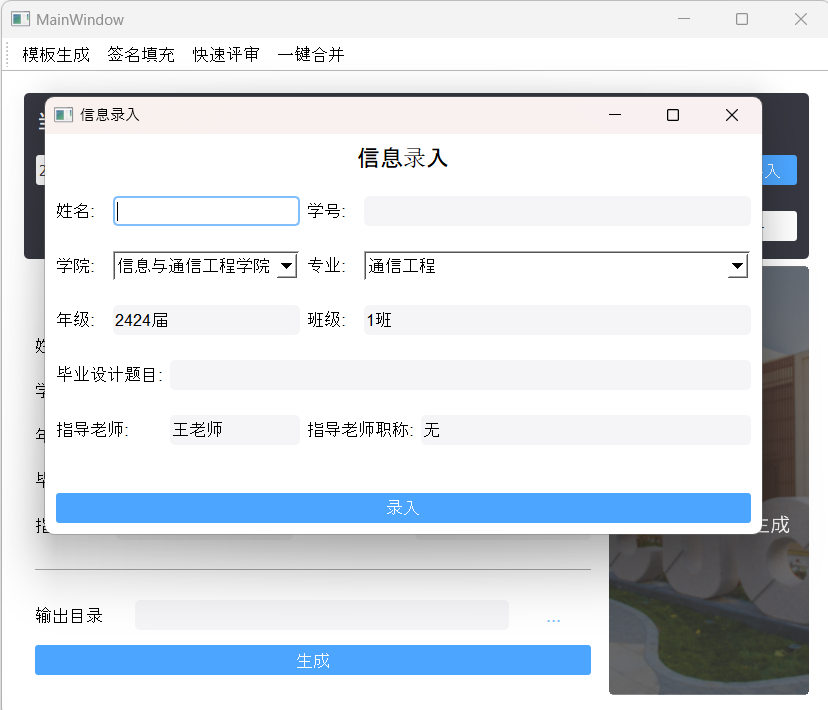

# 毕设自动化 说明文档

# 毕业设计文件自动化填写软件使用说明

## 一、简介

毕业设计文件自动化填写软件是一款专为教师和学生设计的工具，可以帮助您轻松地生成毕业设计文件模板，填充签名，帮助教师评分，一键合并转换docx文件为pdf，以及管理学生数据库。

## 二、功能介绍

1. **一键生成毕设文件模板**：可自动化地将学生信息、毕设标题等内容填写进毕设文件模板，一键生成带有学生信息的全套毕设文件
2. **签名填充**：可导入学生、指导老师、答辩小组成员的电子签名文件，自动嵌入到毕设模板中
3. **帮助教师评分**：内置开题、中期评审、答辩三个阶段评分系统，教师可以根据学生的毕业设计进行打分，并生成打分完成后的评分表。
4. **将docx文件一键合并转换为pdf**：支持将多个docx文件合并，并一键转换为pdf格式。
5. **学生信息管理**：可记录学生的班级、姓名、学号、毕设标题、指导老师等信息，支持手动添加和批量导入。

## 三、使用指南

1. **安装:**
    - **macOS 平台：** MacOS版本以.app格式封装并压缩为zip格式。下载解压后双击.app文件可直接运行。也可将.app文件拖放到访达窗口左侧菜单栏中的“应用程序”文件夹中，稍后可将在启动台中找到程序。
    - **Windows 平台：** 该软件以压缩包形式提供，无需安装。您只需下载压缩包，然后解压到任意目录。解压完成后，双击其中的exe文件即可运行软件。解压到包含中文字符的目录可能导致程序运行异常。
2. **学生信息管理**:
    
            学生信息管理界面位于页面顶部黑色区域，支持手动录入学生信息或基于excel模板批量导入学生信息。
    
    
    
            点击当前学生可在下拉菜单中切换当前操作的学生。
    
    
    
            点击批量导入功能即可选择Excel文件（需使用软件提供的模板填写）并预览，点击Confirm按钮即可导入。若需要导入的Excel文件存在格式非法的字段，软件将报错提示。
    
    
    
            点击手动录入即可手动输入学生信息，若输入格式不符合要求，软件将会报错提示。
    
    
    
3. **模板生成：**
    
            点击模板生成界面，使用学生管理面板选择需要导出模板的学生。点击输出目录右侧按钮选择输出路径，再点击页面底部的生成按钮即可一键生成毕设文件模板。
    
    
    
4. **签名填充：**
    
            进入签名填充页面后，首先需要点击学生管理面板下方的加号按钮导入电子签名图片。随后，点击待填充文件列表右侧的按钮选择需要填充签名的文件。最后点击底部填充签名按钮即可实现签名填充。
    
    
    
5. **快速评审：**
    
            进入签名填充页面后，点击当前学生，选中当前需要评分的学生后，即可在下方评审面板中为各个项目评分。评分完成后，点击输出目录右侧按钮选择输出路径，再点击底部生成按钮即可生成带有评分信息的相关文件。若输入了非数字、非整数分数、超过上限的分数，软件将报错提示。每次填写的分数都会自动保存。
    
    
    
6. **一键合并：**
    
            分别点击选择doc/docx文件和输出目录右侧的两个按钮，指定需要合并的文件和输出合并后的pdf目录。完成后点击生成按钮即可将所选文档合并成一个pdf。
    
    
    

## 四、注意事项

1. 一键合并功能依赖于Microsoft Word，若未安装Word将无法使用该功能。
2. 使用Windows客户端时请暂时关闭Windows Defender杀毒软件，以防客户端被当作病毒清理。